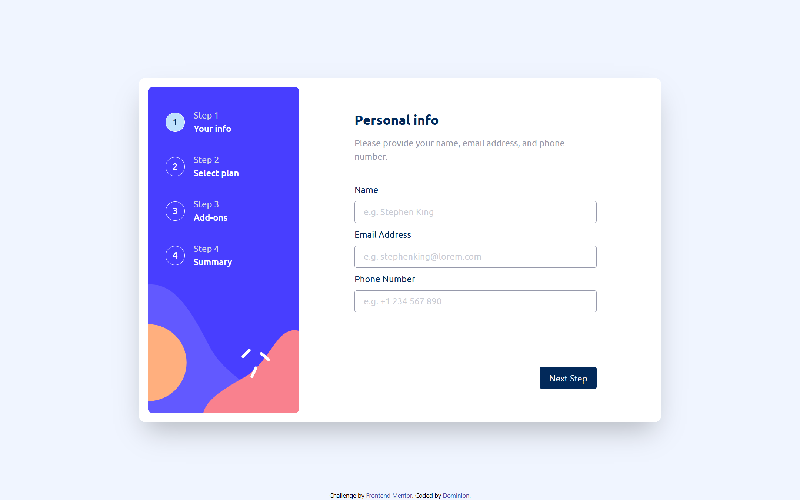
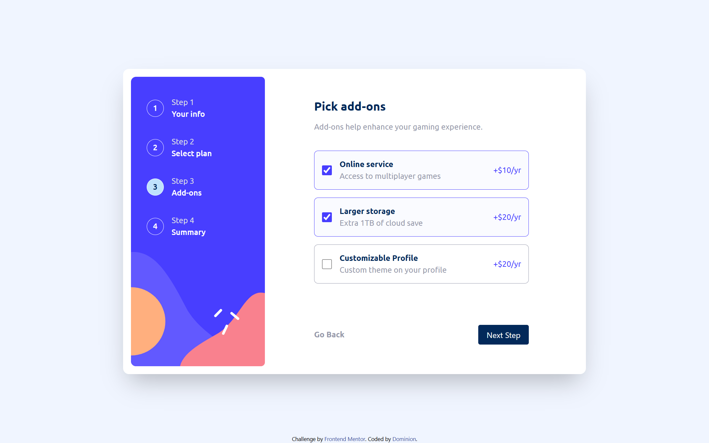
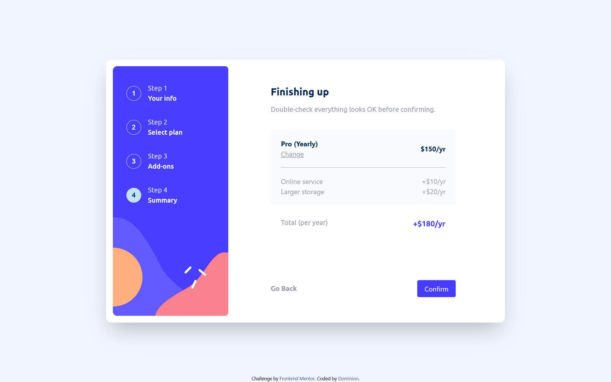
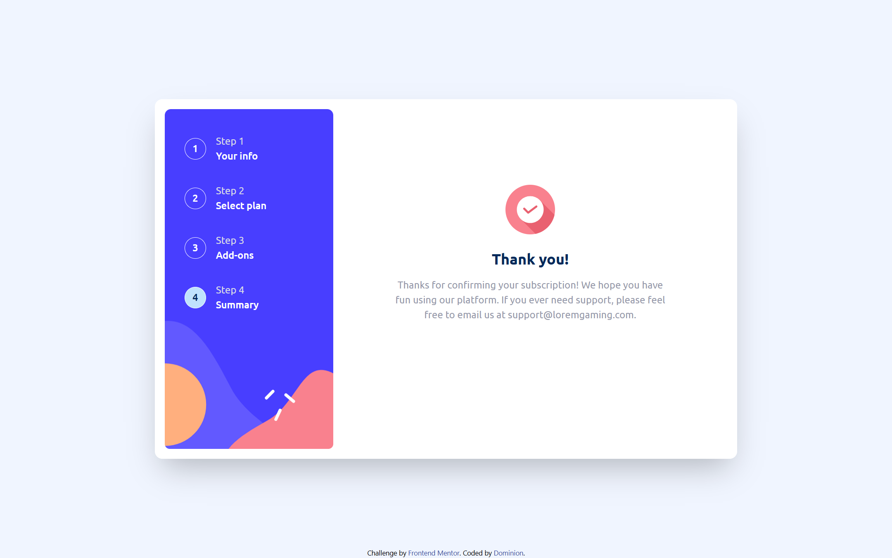
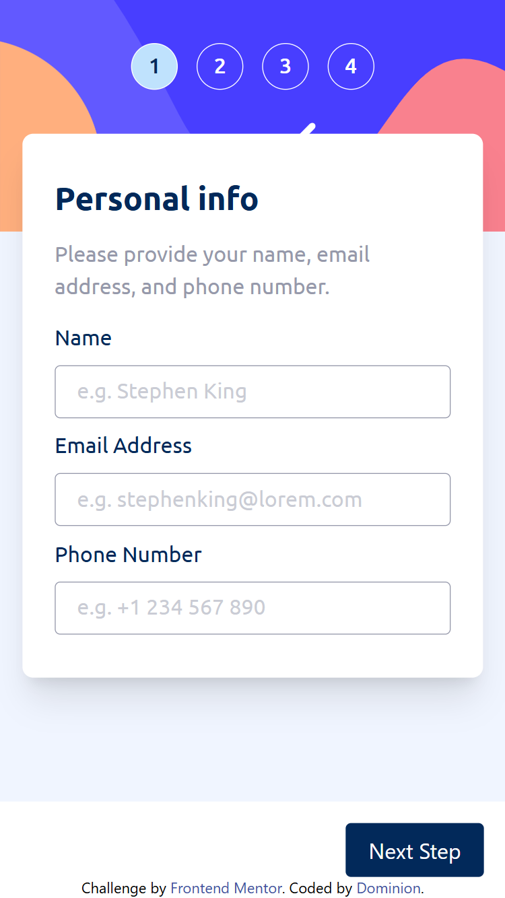
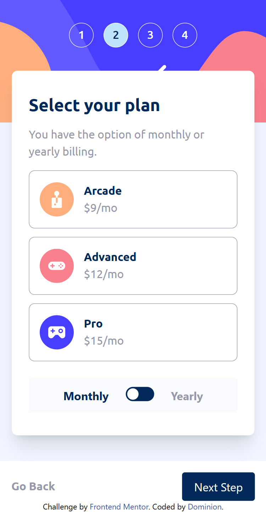
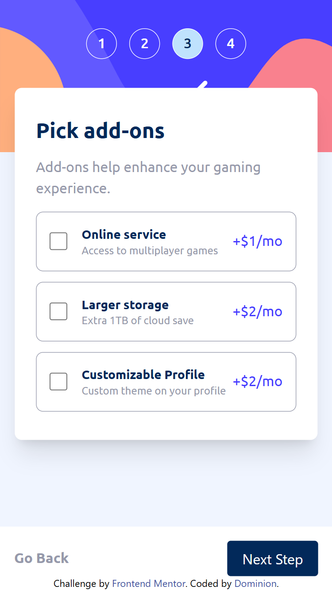
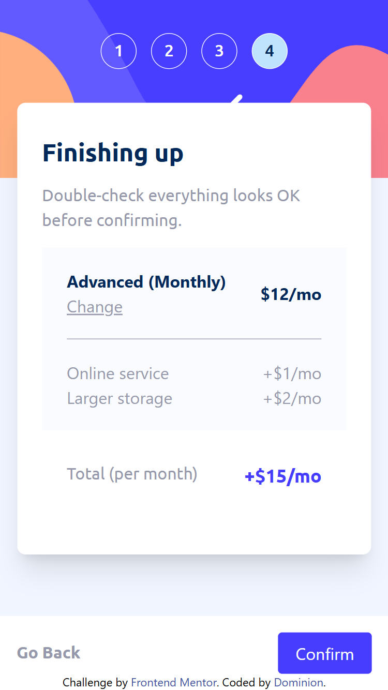
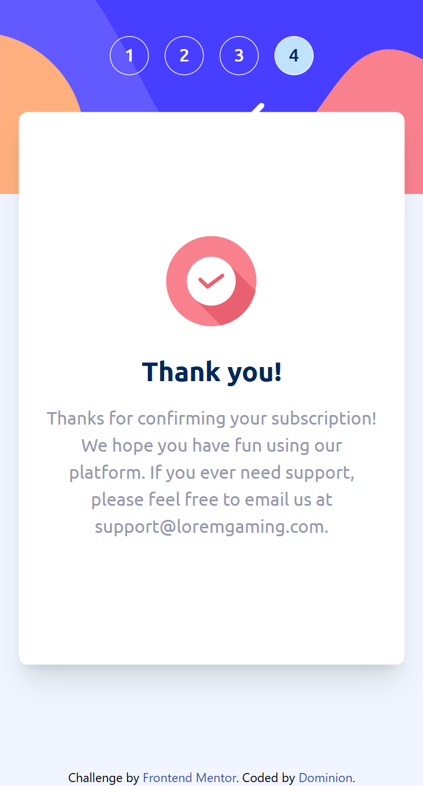

# Frontend Mentor - Multi-step form solution

This is a solution to the [Multi-step form challenge on Frontend Mentor](https://www.frontendmentor.io/challenges/multistep-form-YVAnSdqQBJ). Frontend Mentor challenges help you improve your coding skills by building realistic projects.

## Table of contents

- [Overview](#overview)
  - [The challenge](#the-challenge)
  - [Screenshot](#screenshot)
  - [Links](#links)
- [My process](#my-process)
  - [Built with](#built-with)
  - [What I learned](#what-i-learned)
  - [Continued development](#continued-development)
  - [AI Collaboration](#ai-collaboration)
- [Author](#author)
- [Acknowledgments](#acknowledgments)

## Overview

### The challenge

Users should be able to:

- Complete each step of the sequence
- Go back to a previous step to update their selections
- See a summary of their selections on the final step and confirm their order
- View the optimal layout for the interface depending on their device's screen size
- See hover and focus states for all interactive elements on the page
- Receive form validation messages if:
  - A field has been missed
  - The email address is not formatted correctly
  - A step is submitted, but no selection has been made

### Screenshot

### Links

- Solution URL: [Add solution URL here](https://your-solution-url.com)
- Live Site URL: [Add live site URL here](https://your-live-site-url.com)

## My process

### Built with

- Semantic HTML5 markup
- CSS custom properties
- Tailwind.CSS
- Flexbox
- CSS Grid
- Mobile-first workflow
- Vanilla JavaScript (DOM manipulation and state handling)
- EmailJS (for form submission and email integration)

### What I learned

This project significantly improved my understanding of building interactive multi-step forms and managing state without a framework.
Key takeaways:

- Implemented step-specific validation with reusable functions, ensuring users cannot proceed without valid input
- Managing step navigation (forward/backward) and synchronizing it with UI updates taught me how to structure user flows more effectively.
- I used EmailJS to send form data, which gave me practical experience working with external APIs in frontend projects.

### Continued development

Going forward, I want to:

- Refactor this project using React to better manage state and component structure
- Improve separation of concerns by isolating validation logic, UI updates, and state management
- Implement better error handling and user feedback for async operations (e.g., email sending)
- Optimize performance by reducing repeated DOM queries
- Explore form libraries like React Hook Form for scalability

### AI Collaboration

I used ChatGPT during this project as a development assistant.

- How I used it:
Debugging issues in validation logic and step transitions
Reviewing and improving code structure
Identifying edge cases and potential bugs
Getting feedback on best practices and optimization
- What worked well:
Helped quickly identify logical errors and architectural weaknesses
Provided alternative approaches to structuring functions and state
Improved my understanding of clean and maintainable code
- What didn’t work well:
Some suggestions needed adjustment to fit my specific project structure
Required careful review to avoid overcomplicating simple logic

## Author

- Frontend Mentor - [@why-not-phoenix](https://www.frontendmentor.io/profile/why-not-phoenix)
- Twitter - [@dominion_onoja](https://x.com/dominion_onoja)

## Acknowledgments

Grateful for online resources and documentation that helped clarify concepts during development.
